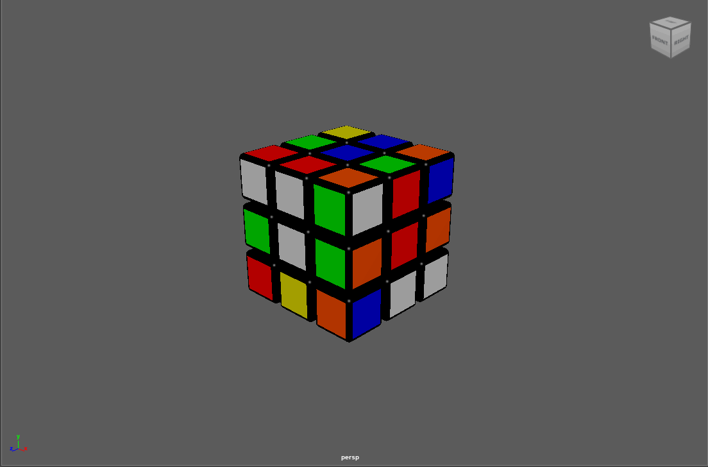
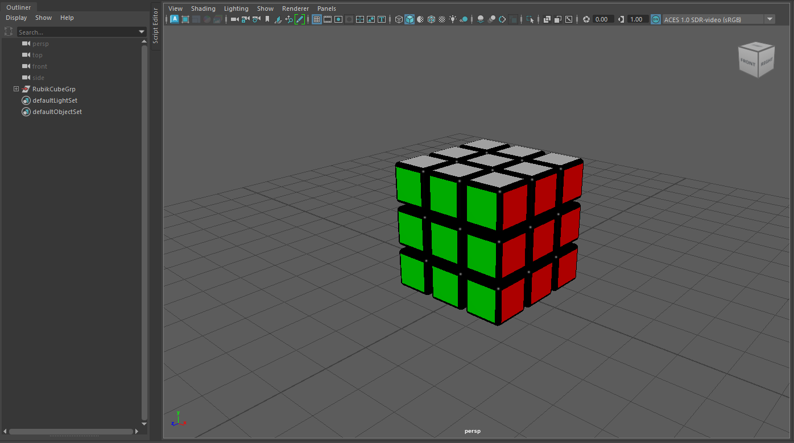
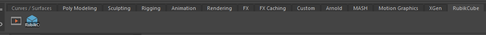
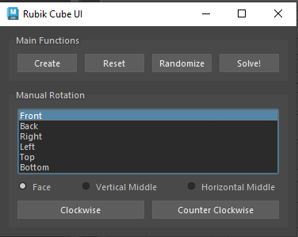

# Rubik Cube Script for Maya

The Rubik Cube python script allows a user to model and manipulate a Rubik's cube in any Maya scene. 

Features include:
* Create a fully-textured Rubik Cube
* Manually rotate any face
* Randomize the cube
* Solve the cube

All rotations are recorded as an animation which can be watched as a playback video or rendered.

## Installation

The repo contains two files:
1. rubik.py
2. rubikCube.mb

To utilize the script with Maya, save rubik.py to your "scripts" folder in your project. Then open the script editor in your scene and open the rubik.py script. Run the script from Maya's script editor. The script can also be saved to your shelf for easy access.

The rubikCube.mb file is a pre-generated scene with the modeled cube. The script is already loaded into a custom shelf. Simply download and open to scene in Maya. 

Scene Viewport

Scene Custom Shelf

## Features
### Basic UI

### Creation
To create the Rubik's Cube, press the "Create" button under the Main Functions section in the UI. This will create a 3x3 array of cubes with width/height = 1.0 and the distance between the cubes = 0.1. The bottom-back-left cube is the first cube created. Every other cube is an instance of this cube. CUbes will be grouped together in a default "RubikCubeGrp".

Cube dimensions can be scaled using the Maya tools or by editing the width and dist variables in the Cube.create() method. The cube can also be moved, rotated, etc. with any other Maya tools but weird behavior may occur if cube coordinates relative to each other are not preserved. 

Cube creation will take a couple seconds. 

### Manual Rotations
Manual rotations have 3 inputs:
1. Side - Front, Back, Right, Left, Top, or Bottom
2. Section - Face, Vertical Middle, or Horizontal Middle
3. Rotation  - Clockwise (CW) or Counter-Clockwise (CCW)

Face refers to each of the outside sides of the cube whereas section refers to which section of the side the user would like to rotate. Each rotation requires both inputs. 

The script will highlight which section you have selected based on the combination of both inputs. (Top and Bottom sides cannot be combined with Vertical Middle)

Ex) Top Face

Ex) Front/Back Vertical Middle 

Ex) Right/Left Vertical Middle 

Ex) Horizontal Middle 

After selecting your desired face, press the Clockwise or Counter Clockwise buttons to rotate your section.

### Randomize
The script will randomize the cube faces for you by performing 10 random rotations.

### Solve
After rotations have been applied, the script will solve your cube and save the rotations as a new animation video.

### Reset
If needed, the cube can be reset at any time by pressing the reset button. This will return the cube to its base position and rotations as if you had created the cube for the first time.

### Animations
All rotations are keyframed at 10 frames apart. Use the animation features in Maya to playback the video within the viewport or use the Playblast tool to see a temporary video. The animations can then be rendered. 

## License

[MIT](https://choosealicense.com/licenses/mit/)
